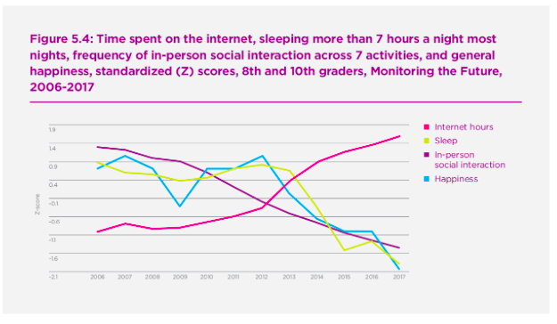
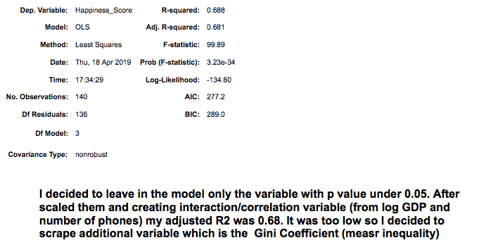
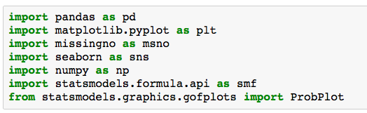

# World-Happiness-Report - Can Predict Happiness be Predicted?  

# Goal

Using publicly available data, I tried to examine which variables can predict happiness. I took the Happiness score from "The World Happiness Report 2017" (which is based mainly on people own personal responses). I collected different data from the world bank sources, and was able eventually to have a model with a resulting Adjusted R^2 value of .711.

# Procedure
Getting the Data
I downloaded two data-sets from kaggle.com: "The World Happiness Report" and World Bank Data regarding the countries of the world. After cleaning the Data I created one merged pandas data frame out of them.  I also scraped "GINI Coefficient" table from indexmundi.com.

# Cleaning the Data
The process for cleaning the raw data is covered in the Data Cleaning Jupyter notebook. Entries with missing values were either dropped or replaced manually with information from different sources or with the regional mode/average. 

# Exploring and Engineering the Data
Visualization of the data and the choices made for engineering new features can be found in the  Jupyter notebook. In general I tried to distill the variables with lower p value and create model as simple as possible without lowering the Adjusted R^2 significantly.

A

A

A

A

## Feature Ingineering

A

A

A

# Modeling the Data

A

during the process I found out that predicting Happiness can be very complicated and that some variables cancel others or have different influence in different countries. The final model and the reasoning behind which features were included and excluded can be found in the Jupyter notebook. In general, the main variable which I created was based on log of GDP per Capita. Other variable which stayed part of the final model where Death-rate,GINI Coefficient and to local dummy variables to specific areas (NEAR_EAST and SUB_SAHARAN_AFRICA)

A

A

.png)

