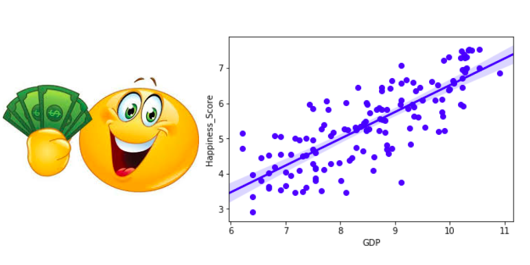
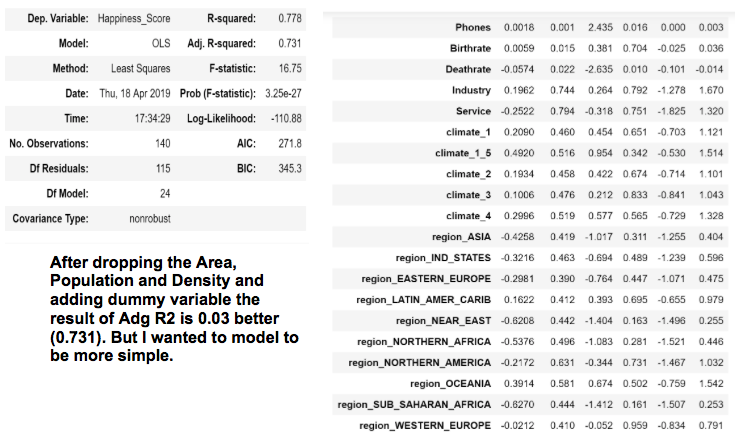

# World-Happiness-Report - Can Predict Happiness be Predicted?  

# Goal

Using publicly available data, I tried to examine which dependent variables can predict the feeling of happiness among people around the world. My dependent variable was the Happiness score from "The World Happiness Report 2017". I collected additional data from the world bank sources, and was able eventually to have a model with a resulting Adjusted R^2 of .711.

# Procedure

Getting the Data: I downloaded two data-sets from kaggle.com: "The World Happiness Report" and World Bank Data regarding the countries of the world. After cleaning the Data I created one joint pandas data frame.  I also scraped "GINI Coefficient" table from www.indexmundi.com.

# Cleaning the Data
Entries with missing values were either dropped or replaced manually with information from different sources or with the regional mode/average. 

# Exploring and Engineering the Data

First I created an histograms of the data to have a better understanding of the different distributions:

Outliers influence are even more clear from the scatter plot chart

 I used Seaborn to visualize the correlations between the independent variable and the happiness score:

## Feature Ingineering

I tried  different methods of feature engneering like log, square and interaction.

# Modeling the Data

For the model I used Statsmodel OLS (Ordinary Least Squares)

From the original and the new features, I selected only the variables with relatively low p value and created more simple model without lowering significantly the Adjusted R^2. for my prediction I used again Statsmodel OLS (Ordinary Least Squares)
During the process I found out that predicting Happiness can be very complicated and that some variables cancel others or have different influence in different countries.  In general, the main variable which I created was based on **log of GDP per Capita**. Other variable which stayed part of the final model where Death-rate,GINI Coefficient and local dummy variables of specific areas (NEAR_EAST and SUB_SAHARAN_AFRICA)

During the process I found out that predicting Happiness can be very complicated and that some variables cancel others or have different influence in different countries.  In general, the main variable which I created was based on **log of GDP per Capita**. Other variable which stayed part of the final model where Death-rate,GINI Coefficient and local dummy variables of specific areas (NEAR_EAST and SUB_SAHARAN_AFRICA)

